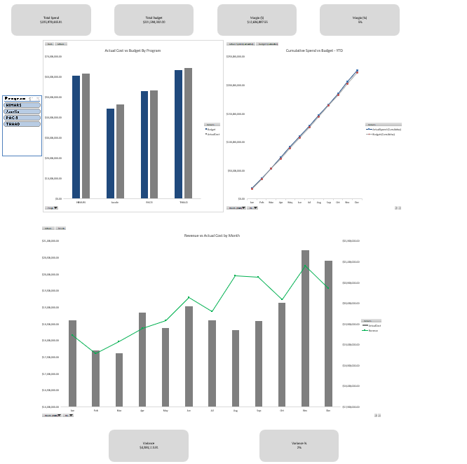
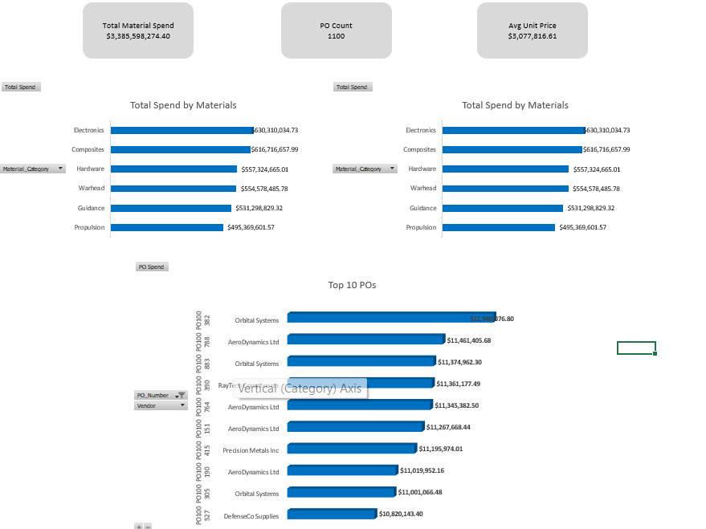
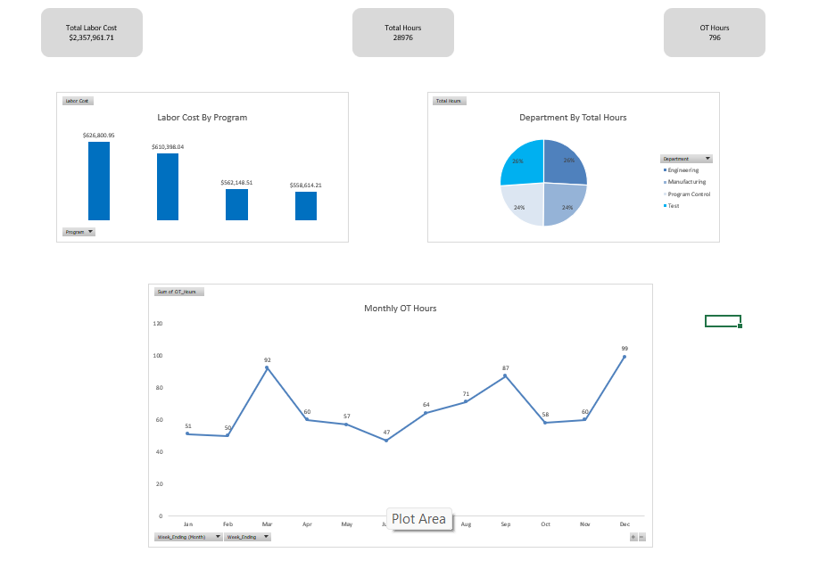

# Financial-Analysis-Project
This project is a three-page financial analysis dashboard built in Excel using PivotTables, Power Query, and the Data Model. It consolidates program cost data, material purchasing data, and labor hours into a structured reporting system designed to support executive-level financial analysis.
Project Overview

The dashboards analyze financial performance, procurement activity, and labor allocation. All metrics and visuals are generated using linked PivotTables, relationships, and structured data modeling. The objective is to transform raw operational data into clear, interpretable insights for decision-making.

Dashboard Pages
Page 1 — Executive Financial Summary

Provides a high-level overview of financial performance, including:

Total Spend vs Budget

Variance and Margin

Actual Cost vs Budget by Program

Revenue vs Actual Cost

Year-to-Date Cumulative Spend Trend

Screenshot:

Page 2 — Material Spend Dashboard

Focuses on procurement and material cost drivers. Includes:

Total Material Spend

Purchase Order Count

Average Unit Price

Spend by Material Category

Spend by Vendor

Top 10 Purchase Orders

Screenshot:

Page 3 — Labor Analysis Dashboard

Analyzes labor hours and cost distribution, including:

Total Labor Cost

Total Hours and Overtime Hours

Labor Cost by Program

Department Mix of Hours

Monthly Overtime Trend

Screenshot:

## Key Insights

- **Total program spend was ~$226.0M against a $221.6M budget** — a **1.98% cost overrun** ($4.38M) across all four programs tracked in 2024.
- **Javelin ran the furthest over budget at 4.77%** ($2.12M variance), while PAC-3 stayed tightest at 0.71% — flagging Javelin as the priority program for cost control review.
- **Material spend totaled ~$3.39B across 1,100 purchase orders**, with **Electronics ($630M) and Composites ($617M)** as the top two cost-driving categories.
- **AeroDynamics Ltd and Precision Metals Inc were the top two vendors by spend** (~$731M and ~$730M respectively), together representing a large share of total procurement — a natural focus area for vendor negotiation or consolidation.
- **Labor costs totaled ~$2.36M across 28,976 hours**, with **overtime accounting for only 2.75% of total hours** (796 OT hours, ~$96.5K in OT cost) — indicating labor allocation stayed close to planned levels with minimal overtime strain.
- **HIMARS carried the highest labor cost of the four programs** (~$627K), narrowly ahead of Javelin, PAC-3, and THAAD, which were all within a tight band of each other.

These insights supported budget variance tracking, vendor spend analysis, and labor cost control across four concurrent programs.

Tools and Methods Used:

Microsoft Excel

PivotTables and PivotCharts

Power Query for data shaping

Data Model with relationships

Custom KPIs and formulas

Professional chart formatting and layout

Author:

Sean
Business Information Systems student with interests in financial analysis, operations, and data-driven reporting.
